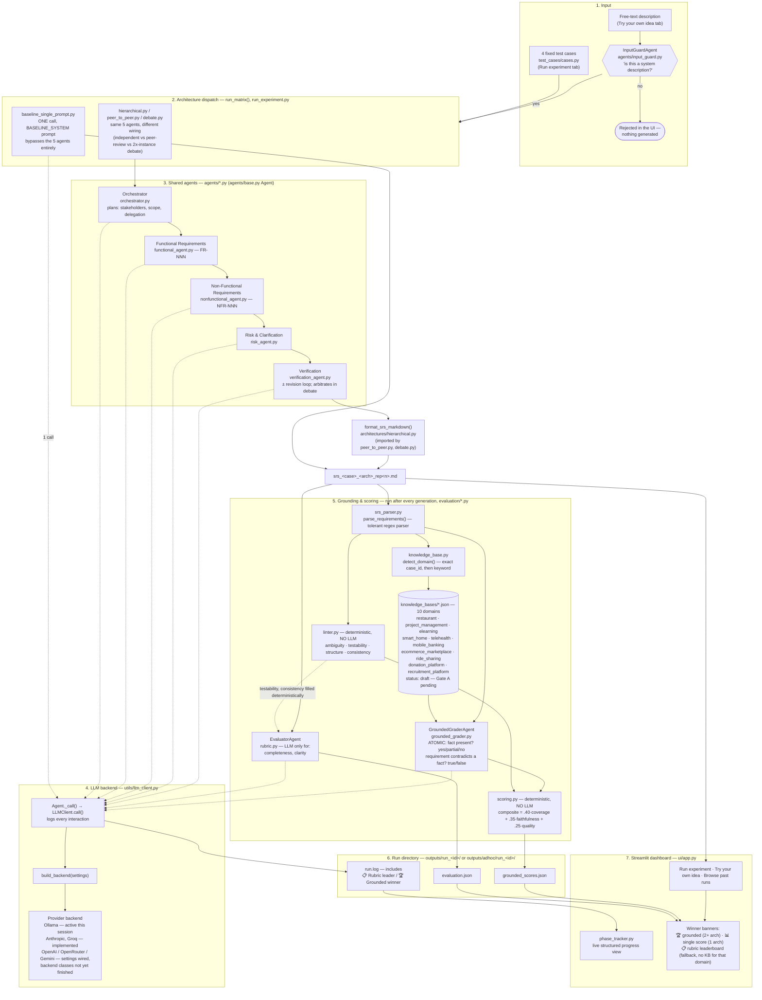

# Multi-Agent Generation of Software Requirements Specifications

MSc Advanced Computer Science dissertation project — University of Birmingham.

Author: Harshdev Singh
Repository: <https://git.cs.bham.ac.uk/> (University GitLab)

---

## 1. Overview

This project generates structured Software Requirements Specifications (SRS)
from natural-language system descriptions using a system of specialised LLM
agents, and compares **three agent collaboration architectures** against a
**single-prompt baseline**.

The research contribution is the comparison, not the generator. Accordingly the
codebase is built as a controlled experiment: the agent prompts, the model, and
every generation parameter are held constant across conditions, and the only
variable is how the agents are wired together.

| Condition | Description |
| --- | --- |
| `baseline_single_prompt` | One LLM call with an optimised prompt that produces a complete SRS. |
| `hierarchical` | An Orchestrator decomposes the task and delegates top-down; specialists work independently; a Verification Agent may trigger a targeted revision round. |
| `peer_to_peer` | Specialists first produce independent drafts, then revise their own section after reading peers' drafts, then verification (and optional revision) runs as in hierarchical. |
| `debate` | Two independent instances of each specialist propose competing positions; each sees the other and produces a rebuttal; the Verification Agent arbitrates per section; a final verification pass catches cross-section defects. |

### Agents (shared, byte-identical role prompts across every architecture)

| Agent | Responsibility |
| --- | --- |
| Orchestrator | Parses the input, identifies stakeholders and system type, delegates to specialists. |
| Functional Requirements | Produces atomic, testable functional requirements (`FR-NNN` format). |
| Non-Functional Requirements | Produces measurable non-functional requirements (`NFR-NNN` format) covering performance, security, scalability, and related qualities. |
| Risk & Clarification | Identifies constraints, risks, ambiguities, and open questions. |
| Verification | Assesses the SRS for consistency, completeness, and testability against ISO/IEC/IEEE 29148; may trigger a revision round; acts as arbiter in the debate architecture. |

### Test cases (from the project brief)

`test_cases/cases.py` defines ten cases spanning ten distinct domains, chosen
so no two cases share the same regulatory profile or functional shape: a
restaurant-chain mobile app, a web-based project management tool, a
university e-learning platform, a smart-home automation system, a
telehealth consultation platform, a mobile banking app, an online seller
marketplace, a ride-sharing platform, a charity donation/crowdfunding
platform, and an applicant tracking system.

### End-to-end architecture

Everything below is real, current code — every node names the actual file or
function it represents, not a conceptual stand-in. `baseline_single_prompt`
is drawn separately because it genuinely bypasses the five shared agents and
`format_srs_markdown()` entirely: it is one LLM call whose prompt
(`BASELINE_SYSTEM`) asks the model to output the fully-formatted document
directly. The other three architectures share the same five agents and the
same assembly function; they differ only in how they wire agent calls
together (see the architecture table above).



**Legend / reading notes:**
- **Solid arrows** = real control/data flow in the code. **Dotted arrows** = "calls the LLM backend" or "merges into" (kept dotted purely to reduce visual clutter from every agent individually fanning into `CALL`).
- Every LLM call in the diagram — generation, evaluation, grounded grading, and the input guard — passes through the **same** `LLMClient.call()` (`BACKEND` subgraph), so every interaction is logged identically to `llm_interactions.jsonl` regardless of which part of the pipeline issued it.
- Only `GroundedGraderAgent` and `EvaluatorAgent`'s two LLM-judged dimensions (completeness, clarity) involve model *judgment*. Everything in `linter.py` and `scoring.py` — ambiguity, testability, structure, consistency, coverage, faithfulness, quality, the composite score, and the final ranking — is deterministic Python arithmetic over structured data, not a model opinion.
- `InputGuardAgent` and the knowledge-base domain gate (`detect_domain()` returning no match) are two independent pre-flight checks on the "Try your own idea" tab only — the formal tab's ten test cases never need either, since they're fixed and already known-good.

---

## 2. Current status

All five development stages are code-complete. Actual result generation
(SRS documents, rubric scores, comparative report) requires paid API runs
against the researcher's own API key; the codebase produces them from one
command but does not itself hold or use credentials.

| Stage | Scope | Status |
| --- | --- | --- |
| 1 | Project structure, `.gitignore`, README, configuration, logging | Complete |
| 2 | Hierarchical architecture; five agents; shared prompt library | Complete |
| 3 | Single-prompt baseline | Complete |
| 4 | Peer-to-peer and debate architectures | Complete |
| 5 | Experiment harness, test cases, evaluation rubric, blind-rating export, analysis report generator | Complete |

---

## 3. Setup

Requires Python 3.10 or newer (3.12 recommended; the code uses PEP 604
`X | Y` type syntax).

```bash
cd requirements-multiagent
python3 -m venv .venv
source .venv/bin/activate          # Windows: .venv\Scripts\activate
pip install -r requirements.txt
cp .env.example .env
```

Then open `.env` and set `ANTHROPIC_API_KEY` to a real key. `.env` is
git-ignored; `.env.example` is tracked and must never contain a real key.

Verify the configuration loads:

```bash
python -c "from config.settings import Settings; print(Settings.from_env())"
```

The `__repr__` of `Settings` redacts the API key.

---

## 4. Running the experiment

### One case, one architecture (fast smoke test — stage 2 driver)

```bash
python run_hierarchical.py
```

Runs the restaurant-chain case through the hierarchical architecture only.
Writes artefacts to a fresh `outputs/run_<UTC timestamp>/`.

### Everything (stage 5 harness)

```bash
python run_experiment.py
```

Runs every architecture × every test case × `REPETITIONS`, then evaluates
each SRS with the LLM-as-judge rubric and produces an anonymised export
for human raters. The command prints a plan and asks for confirmation
before starting.

Useful subsets:

```bash
python run_experiment.py --architectures baseline_single_prompt hierarchical
python run_experiment.py --cases TC-01_restaurant_app TC-04_smart_home
python run_experiment.py --skip-evaluation --skip-rater-export
python run_experiment.py --yes   # non-interactive, e.g. from a shell script
```

**Approximate cost at defaults** (ten cases, four architectures,
`REPETITIONS=1`, `MAX_REVISION_ROUNDS=1`, `claude-opus-5`,
`effort=high`): roughly 300 LLM calls in total, ballpark
**£7.50-£15 per full run**. Use `--cases` to restrict to a subset for a
cheaper run. Cost scales linearly with `REPETITIONS` and sub-linearly
with `MAX_REVISION_ROUNDS`.

### Analysis report

```bash
python -m evaluation.generate_report outputs/run_<id>
```

Writes `analysis_report.md` inside the run directory: score tables per
architecture and per case, cost/latency tables, and a list of failed
runs if any.

---

## 5. Project structure

```
requirements-multiagent/
├── .gitignore                         # Excludes secrets, outputs, caches
├── .env.example                       # Template environment file (no real values)
├── README.md
├── requirements.txt
├── config/
│   ├── settings.py                    # Resolved, validated run configuration
│   └── prompts.py                     # Shared agent prompt library (source of truth)
├── agents/
│   ├── base.py                        # Base Agent class + RunContext
│   ├── orchestrator.py                # Planning brief agent
│   ├── functional_agent.py            # FR agent
│   ├── nonfunctional_agent.py         # NFR agent
│   ├── risk_agent.py                  # Risk & clarification agent
│   └── verification_agent.py          # Verification / arbiter agent
├── architectures/
│   ├── hierarchical.py                # Top-down delegation + revision
│   ├── peer_to_peer.py                # Peer review + revision
│   └── debate.py                      # Competing positions + arbitration
├── baseline_single_prompt.py          # Single-call baseline
├── test_cases/
│   └── cases.py                       # The four natural-language inputs
├── evaluation/
│   ├── rubric.py                      # LLM-as-judge scorer
│   ├── export_for_raters.py           # Anonymised export for blind rating
│   └── generate_report.py             # Post-run analysis → analysis_report.md
├── utils/
│   ├── logging.py                     # Structured LLM interaction logging
│   └── client.py                      # Anthropic Messages API wrapper
├── outputs/                           # Run artefacts (git-ignored)
├── run_hierarchical.py                # Stage-2 driver (one case, one arch)
└── run_experiment.py                  # Full experiment harness
```

---

## 6. Dependencies and their justification

Deliberately minimal. Every third-party package is a component the
moderator must trust, so each earns its place.

| Package | Why it is required | Why not the standard library |
| --- | --- | --- |
| `anthropic` | Official SDK for the Anthropic Messages API. Supplies the client, typed response objects (token usage, stop reasons), streaming, and automatic retry with exponential backoff on HTTP 429/5xx. | Hand-rolling the HTTP client would mean reimplementing retry, streaming, and response parsing, adding risk with no research value. |
| `python-dotenv` | Loads `key=value` pairs from a local `.env` file into the process environment, so the API key never appears in source or in a tracked file. | `os.environ` alone would require the key to be exported in every shell, which in practice leads to keys being pasted into scripts. |

Everything else uses the standard library: `json` for the interaction log
and JSON artefacts, `csv` for rater exports, `logging` for the run log,
`dataclasses` for record types, `random` for seeded shuffling,
`statistics` for report aggregations, `pathlib` for filesystem paths.

---

## 7. Logging

Every LLM call is recorded in full. This is what makes the comparison
auditable and is the evidence base for the cost and latency analysis.

Each run writes to `outputs/run_<UTC timestamp>/`:

| File | Contents |
| --- | --- |
| `config.json` | Redacted snapshot of the exact configuration used. |
| `llm_interactions.jsonl` | One JSON object per LLM call (schema below). |
| `run.log` | Human-readable narrative of the run. |
| `run_summary.json` | Call counts, token totals, cumulative latency. |
| `srs_<case>_<architecture>_rep<n>.md` | The generated SRS documents. |
| `brief_<case>_<architecture>_rep<n>.json` | Orchestrator planning brief (multi-agent only). |
| `verification_<case>_<architecture>_rep<n>.json` | Verification verdicts per round (multi-agent only). |
| `arbitration_<case>_debate_rep<n>.json` | Section-level arbitrations (debate only). |
| `evaluation.json` | LLM-as-judge rubric scores (unless `--skip-evaluation`). |
| `rater_export_<id>/` | Anonymised documents + scoring sheet + mapping (unless `--skip-rater-export`). |
| `run_manifest.json` | Summary of every (architecture, case, repetition) attempt. |
| `analysis_report.md` | Written by `evaluation.generate_report` on demand. |

### Interaction record schema

Each line of `llm_interactions.jsonl` is one object:

| Field | Type | Meaning |
| --- | --- | --- |
| `interaction_id` | string | Unique identifier for the call. |
| `run_id` | string | Run this call belongs to. |
| `timestamp` | string | UTC ISO-8601 timestamp when the call was issued. |
| `architecture` | string | `baseline_single_prompt`, `hierarchical`, `peer_to_peer`, `debate`, or `evaluation`. |
| `agent` | string | Agent role that issued the call. |
| `case_id` | string | Test case being processed. |
| `repetition` | integer | Zero-based repetition index for this (architecture, case) pair. |
| `phase` | string | Stage within the protocol (`initial`, `peer_review`, `initial_A`, `rebuttal_B`, `verification_round_1`, `arbitration_functional`, `score`, ...). |
| `model` | string | Model identifier used. |
| `system_prompt` | string | System prompt sent, verbatim (role prompt + protocol block). |
| `messages` | array | `messages` array sent, verbatim. |
| `request_params` | object | Non-prompt request parameters (`max_tokens`, `output_config`, `thinking`). |
| `response_text` | string | Concatenated response text (empty on failure). |
| `stop_reason` | string \| null | `end_turn`, `max_tokens`, `refusal`, ... |
| `usage` | object | `input_tokens`, `output_tokens`, cache read/write tokens, plus derived totals. |
| `latency_ms` | number | Wall-clock duration of the call. |
| `error` | object \| null | Populated only when the call failed. |

### Behaviours worth noting

* **Failures are recorded and re-raised.** A failed call is written with
  an `error` object and the exception propagates. A run that degrades
  must do so visibly. The experiment harness catches failures at the
  per-(architecture, case, repetition) boundary so one bad combination
  does not abort the whole matrix.
* **`stop_reason` other than `end_turn` raises a warning** in the run
  log, because a truncated (`max_tokens`) or refused (`refusal`)
  response would otherwise silently enter the results as if it were a
  complete SRS. Refusals additionally raise `LLMClientError`.
* **Structured outputs are validated.** Agents that request JSON
  responses (orchestrator, verification, debate arbiter, evaluator)
  fail loudly if the response is not valid JSON.

---

## 8. Reproducibility

### What `RANDOM_SEED` controls

`Settings.apply_seed()` seeds Python's global RNG, which makes every
**Python-side** random choice deterministic: test-case ordering, the
shuffle applied when exporting documents for blind rating, and
anonymous ID assignment. Re-running the export with the same seed
reproduces the same anonymised mapping.

### What no seed can control

**LLM output is not deterministic, and this project cannot make it so.**
The Anthropic Messages API exposes no `seed` parameter, and the current
model family (`claude-opus-5`) does not accept `temperature`, `top_p`,
or `top_k` — sending any of them returns an HTTP 400. Identical prompts
can therefore produce different SRS documents on different runs.

Two consequences for the experimental design, both of which should be
stated explicitly in the dissertation:

1. **Reproducibility is procedural, not bit-exact.** What is reproducible
   is the *procedure*: the same configuration, prompts, test cases, and
   seed, with every call logged so a third party can inspect exactly
   what happened. The published `llm_interactions.jsonl` is the record
   of the specific run the results describe.
2. **Between-run variance is a measurable quantity, not noise to be
   hidden.** Set `REPETITIONS` above 1 to run each (architecture, case)
   pair several times. Reporting the spread across repetitions is
   stronger evidence than a single run per condition, and it
   distinguishes a genuine architectural effect from sampling variation.

### What is held constant across conditions

Recorded in `config.json` for every run:

* `MODEL_ID` — the same model for every agent in every condition.
* `MAX_TOKENS`, `EFFORT`, `THINKING_MODE` — identical generation
  parameters.
* The agent prompt library (`config/prompts.py`) — byte-identical role
  prompts across the three multi-agent architectures. Only the
  architecture-specific protocol block appended by
  `compose_system_prompt()` differs, and every logged interaction
  records the composed system prompt in full so a moderator can inspect
  it in place.
* `MAX_REVISION_ROUNDS` — the same cap on Verification-Agent-triggered
  revisions in every architecture that supports revision.
* The `initial`-phase user prompts for the specialists — identical
  across hierarchical, peer-to-peer, and debate. Peer-review, rebuttal,
  and arbitration phases are architecture-specific and are the
  intended variables of the study.

---

## 9. Evaluation

Two evaluation paths are supported and are complementary.

### LLM-as-judge (`evaluation/rubric.py`)

A dedicated evaluator agent — with its own role prompt, deliberately
separated from the specialists so its judgement is not primed by their
prompts — scores each SRS on four dimensions:

* **completeness** — every capability and stakeholder implied by the
  input is covered; every reasonably implied quality attribute has a
  measurable NFR.
* **consistency** — no contradictions, duplications, subsumptions;
  unique identifiers.
* **testability** — every requirement admits a concrete acceptance
  criterion; NFRs have measurable thresholds or defensible `TBD`
  markers surfaced as open questions.
* **clarity** — the SRS is unambiguous. This is the inverse of the
  "ambiguity" dimension named in the project brief: 5 = perfectly clear,
  1 = pervasively ambiguous.

Each is scored 1 (worst) to 5 (best). Scores are written to
`evaluation.json`. Known limitations, worth stating in the dissertation:

* Same-model bias. The evaluator uses the same `MODEL_ID` as the
  generators by default; a model may prefer its own outputs. Using a
  different family for evaluation would strengthen the design.
* LLM-as-judge is a defensible approximation, not a substitute for
  human raters. Treat the scores as a preliminary signal.

### Blind human rating (`evaluation/export_for_raters.py`)

`rater_export_<id>/` contains:

* `documents/DOC-NN.md` — every generated SRS with the run-metadata
  block stripped and the title replaced by the anonymous ID.
* `scoring_sheet.csv` — one row per document with empty score cells.
* `mapping.json` — private mapping from anonymous ID back to (case,
  architecture, repetition). **Do not share this with raters.**
* `README.md` — cover letter and instructions for the raters.

Document order is shuffled deterministically using `RANDOM_SEED`.

Rating multiple documents by human raters typically requires ethics
review; start that process early if you plan to include human scores in
the dissertation.

---

## 10. Security and data handling

* Real credentials live only in `.env`, which is git-ignored.
  `.env.example` contains placeholders and is the only tracked
  environment file.
* `Settings.to_dict()` and `Settings.__repr__()` redact the API key, so
  configuration snapshots and debug output are safe to share.
* `outputs/` is git-ignored by default because interaction logs contain
  full prompts and responses and can be large. To submit a frozen result
  set with the dissertation, force-add that specific directory:
  `git add -f outputs/run_<id>/`.
* Test cases are synthetic system descriptions. No personal or
  commercially confidential data should be used as experiment input.
* The rater export deliberately keeps `mapping.json` outside the
  `documents/` folder so it is not accidentally packaged and sent to
  raters.

---

## 11. Licence and attribution

Academic work submitted for assessment at the University of Birmingham.
All source code in this repository was written for this project.
